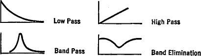
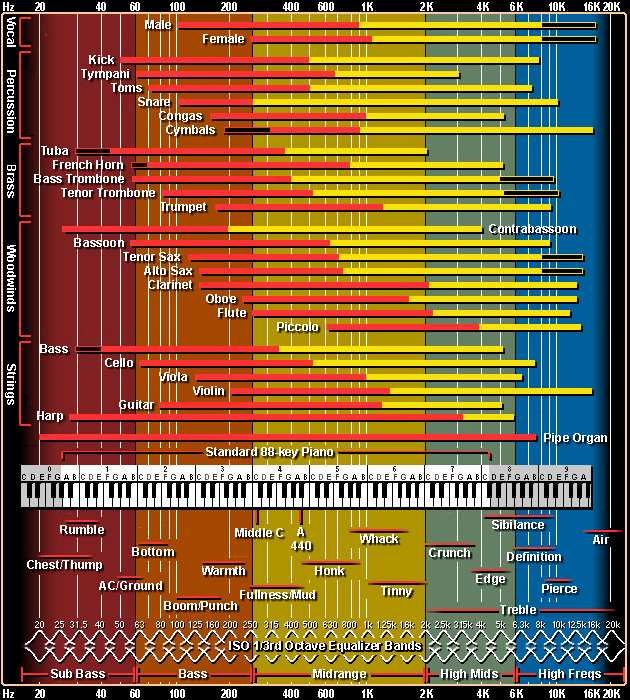

# How I Mix / Master / Export

## How I Mix

### Info before we start

> ### Filters
> A Filter only lets a certain frequency through.\
> 
> - 1 **LP / Low Pass**es the low end through.
> - 2 **BP / Band Pass**es a certain frequency range.
> - 3 **HP / High Pass**es the high end through.
> - 4 **Notch / Band Elimination** eliminates a specific frequency range (sort of vise versa BP).
> 
> Sometimes there’s really nothing or way too much going on at a certain frequency. You’ll be able to see the frequency representation when you use an analyzer, so you’ll be able to gauge how much you can filter by looking at the analyzer.
**But remember It’s a good crutch, but don’t rely on your eyes to mix!**
>
> #### Kick Drums
>  - Are bass instruments so they’re rarely filtered above (_beneath?_) 32 Hz
>  - You can reduce bleed from the rest of the drums by low-pass filtering the kick drum down to the high-mids, about 5-10 kHz depending on what sounds good.
>  - Take some of the oomph out of the snare drum (especially if the kick is bleeding into the snare mic) by filtering everything below 100 Hz (_Side-chain a filter on the snare?_).
>
> #### Bass
>  - Rarely high-pass filter the bass higher than about 40 Hz, just to get rid of any low-end rumble it might have.
>  - If you’re looking for a rounder bass that functions more like a pad than a string instrument then you can filter out all the highs to just accent the lows and the low-mids. Just move the filter down into the >mids until it sounds right.
>
> #### Guitars, Keys and Vocals
>  - Guitars are mostly high-pass filtered up to 100 Hz.
>    - You can high-pass your guitars even higher, depending on the arrangement and how busy the mix is with other instruments. If your guitars are clashing with other instruments in the low-mids chances are you can >fit them together with the right filter frequency (or a parametric boost).
>    - If you’re worried about filtering too much just put your guitars in solo and sweep the filter up the frequency spectrum until the guitar (or any other instrument) starts to sound too thin, then back off to >right before that.
>    - It might sound great in solo but you may want the guitar to sound a little thinner to fit in the mix, so make sure you A/B the filtered guitar in context with the rest of  the mix.
>- One of my favorite filter tips is to use a low-pass filter on distorted electric guitars that combines a boost at the cut-off frequency. Most filters will let you add a resonant boost at the cut-off frequency if >you increase the Q.
>
> #### Keys and Pianos
>  - 
[Crush it with EQ - 71 EQ Hacks](https://github.com/ThijsWaalders/How-To-Music/blob/master/Mix%20Master%20and%20Export/How%20I%20mix%20and%20master/Crush-It-With-EQ-71-EQ-Hacks.pdf)

#############################################################################################
>### EQualizers
>
> \
>
>  - 1 **Low**
>  - 2 **Low-Mid**
>  - 3 **High-Mid**
>  - 4 **High**
>  - 5
>  - 6
>  - 7

> ### Do's and Don'ts
> #### Do's
>
> #### Don'ts
> 1 - **Using EQ Too Soon**\
> Make sure that the volumes of each element in the mix are balanced before reaching for an EQ plugin. If you have to make huge cuts in a bass to make it fit, it might just be that the bass is too loud and needs a few dB of gain reduction before EQ.\
> 2 - **Over Using The Solo Button**\
> When mixing, you are trying to make all the sounds in a mix work together. When using EQ in solo it becomes more difficult to judge how a sound will fit into the mix. Try leaving the other tracks unmuted and work with the EQ to make it fit. The exception would be when using subtractive EQ to remove unwanted noise and muddiness. Often using the solo button during this process can help you hear more clearly.\
> 3 - **Not Being Bold Enough**\
> If you need to make a big boost or cut to make it sound right, do it. If you need to be very gentle and subtle to make something fit, that’s perfectly fine too. Do what is right for the situation and don’t worry about what it looks like - only what it sounds like!\
 4 - **All Boost, No Cut**\
> Boosting an EQ is fun but the real magic happens when you start cutting away unwanted mess and clutter.\
> Try cutting away unwanted bass from lead instruments and unwanted midrange muddiness from synths. It might be what your track needs to help the good stuff shine through. Always let your ears guide you.\
> 5 - **Experimenting**\
> All EQ plugins will sound different. They can all have a place whether a free stock EQ or an expensive analogue model. Learning their differences and knowing what to use in each situation is part of the fun and skill of being a mix engineer.\
> Know your tools well but don’t be afraid to try something new.\

#############################################################################################
**Nachecken**: Geld dit voor alles TIPS?!?:

If you’re worried about filtering too much just put your **instrument?** in solo and sweep the filter
up the frequency spectrum until the guitar (or any other instrument) starts to sound too
thin, then back off to right before that. (instrument was guitar)

## Mastering
Remember mastering can only boost your track for 2/3%.\
At each stage I ask myself: What am I trying to achieve by using this VST?
 1. Have an aim when/what you are mastering.\
Put these kind of vst's in this order on your master track:
    1. **Equalizer**
    2. **Limiter**
    3. **Tonal Control** (from iZotope):\
    This will help it sound good on all systems. Use reference track and compare to professional releases. If you hear that your balance is off you can use subtle EQ or go back to the mix to fix big problems.
    4. **Loudness meter** like Youlean Loudness meter.\
    Put the average meter around -14LU.
    5. **Frequency Analyzer** like SPAN
    6. If needed use **compression** as last.
2. Be sure your **track is not clipping and has enough headroom**.
3. Be sure your **master volumes doesn't go beyond 0dB** (use an automation clip, start at 0 and fade up, vise versa for the end of the track).\
   Listen from the start to the end without changing anything and listen if you can **find any mistakes like clipping/cracks/etc**.
4. Is the complete track's **volume balanced correctly**?\
   Be sure the balance of frequencies is correct so you can hear the track on different devices (like a club and your phone or home speakers). This is were **Tonal Control** becomes handy. You can add a compressor to enhance the balance or warmth.
5. Finally **be sure your track is loud enough** BUT NEVER TO LOUD!! It should have an average loudness range (Short Term Max) around -14LUFS. Use the limiter (ceiling at -1dB and lower the threshold until you get around -14LUFS average).

## Exporting
The settings will change for where you wan't to distribute your song like Spotify / cd / Soundcloud / clubs / etc.
1. Use the **WAV** file format for the best quality.
3. **Bit depth**: 24Bit, 16Bit for cd (check if 24**+** is supported where you wan't to distribute your song to be sure).
4. **Sample Rate**: 44100Hz (44.1kHz) max for cd, for streaming/most mediums you can go higher (I personally mix and export at 48000Hz(48kHz).

### Do's and don'ts
- Convert to MONO if it is an sub bass sound / frequency or if you are DJing the whole track
- Normalize (No for tracks, yes for sounds/stems)
- Dithering is only for 16 bit, for cd's, but who uses cd's anymore!

### Resources
[How to Master Your Music in 5 Simple Steps](https://www.youtube.com/watch?v=h-QCQiOkufc&t=0s&list=LL2HjwFFZ-oHlvYWr6Jaz7Tw&index=3)\
[Youlean Loudness Meter](ttps://www.youtube.com/redirect?v=h-QCQiOkufc&event=video_description&redir_token=ytwDKKsN-CCgvdP2Hc5esgiK1jF8MTUzMjk0NDY3NEAxNTMyODU4Mjc0&q=https%3A%2F%2Fyoulean.co%2Fyoulean-loudness-meter%2F)\
[SPAN from Voxengo](https://www.youtube.com/redirect?v=h-QCQiOkufc&event=video_description&redir_token=ytwDKKsN-CCgvdP2Hc5esgiK1jF8MTUzMjk0NDY3NEAxNTMyODU4Mjc0&q=https%3A%2F%2Fwww.voxengo.com%2Fproduct%2Fspan%2F)
