# Scale Degrees

* Each note of a scale has a special name, called a **scale degree**.

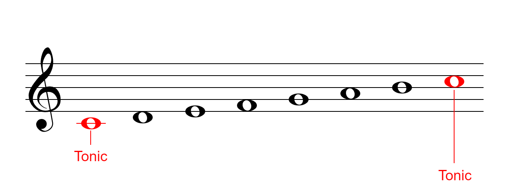

* The first (and last) note is called the **tonic**.

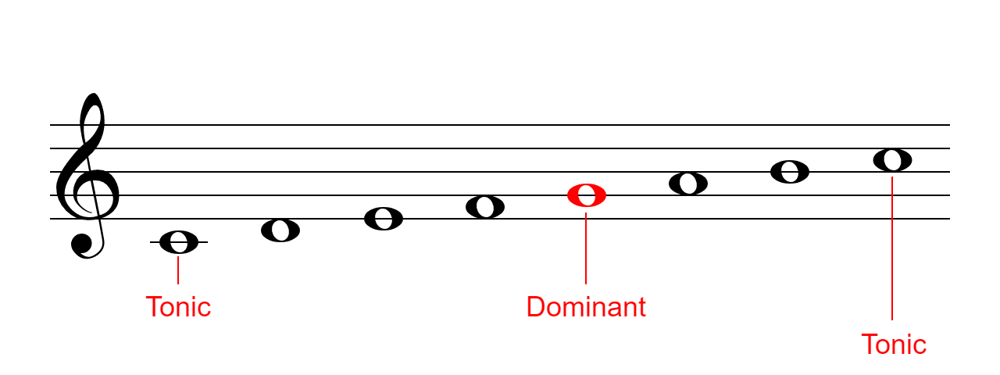

* The fifth note is called the **dominant**.

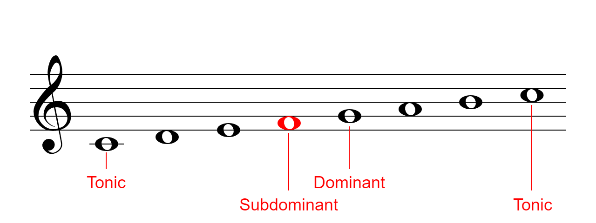

* The fourth note is called the **subdominant**.

---

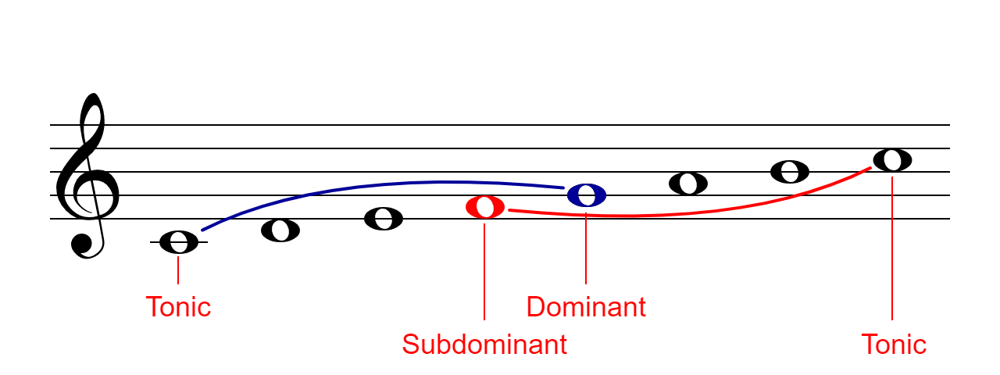

* Notice that the **subdominant** is the same distance below the tonic as the **dominant** is above it (a generic fifth).

* The prefix _Sub_ is Latin for "under" or "beneath".

---

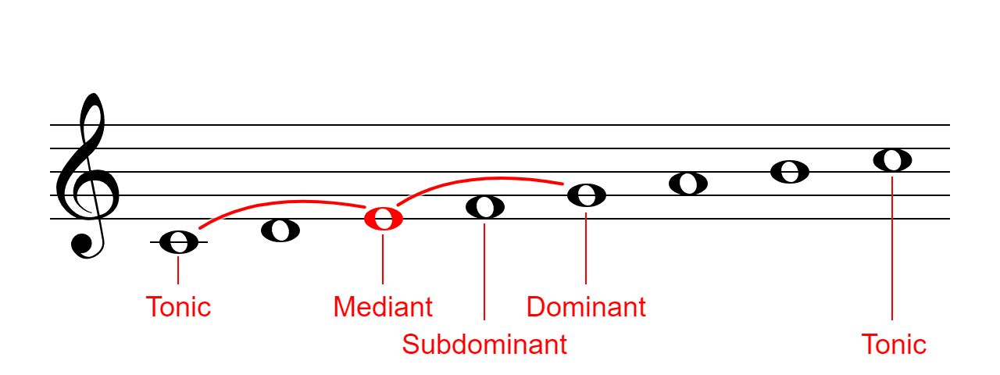

* The third note is called the **mediant** since it is in the _middle_ of the tonic and dominant.

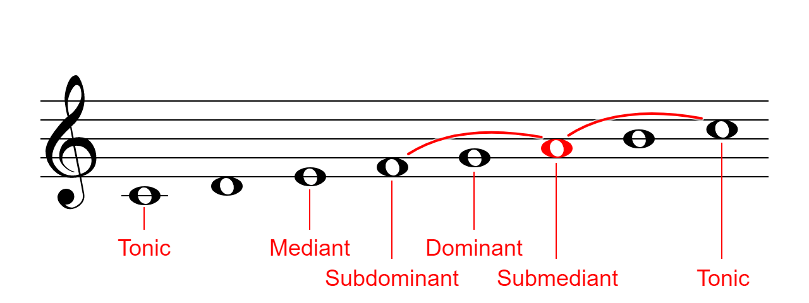

* Likewise, the sixth note is called the **submediant** since it is in the middle of the upper tonic and _subdominant_.

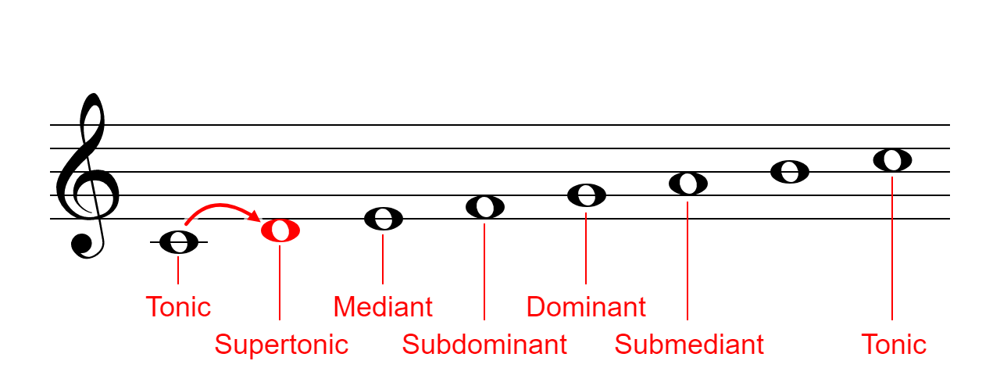

* The second note is called the **supertonic**. _Super_ is Latin for "above".

---

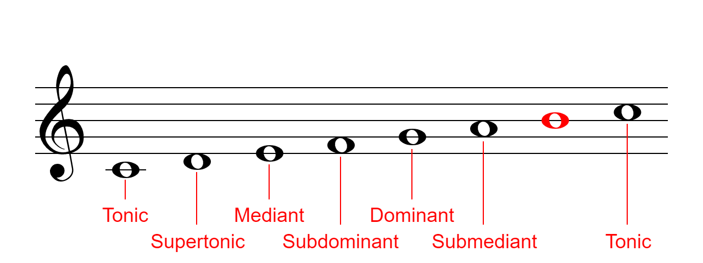

* While the scale degrees for the first six notes are the same for both major and minor scales, the seventh one is special.

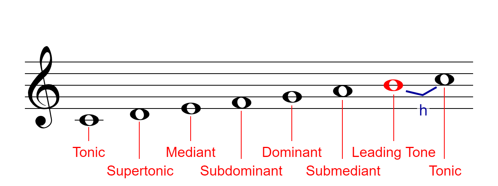

* If the seventh note is a half step below the tonic, it is called a **leading tone**.

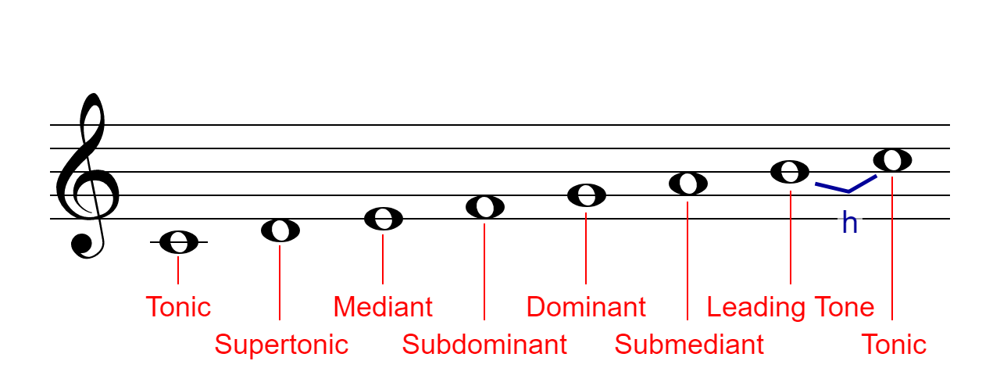

* Play the **C Major** scale and notice how the seventh note wants to _lead_ into the tonic.

* Leading tones also occur in harmonic minor and melodic minor.

---

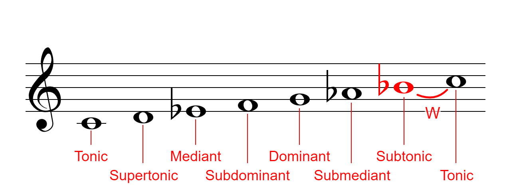

* In natural minor, the seventh note is a whole step below the tonic. In this case, the note is called a **Subtonic**.

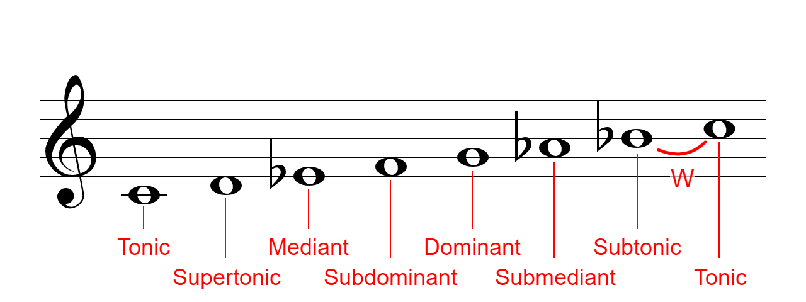

* Play the **C Natural Minor** scale and notice how the seventh tone lacks the desire to lead into the tonic.

---

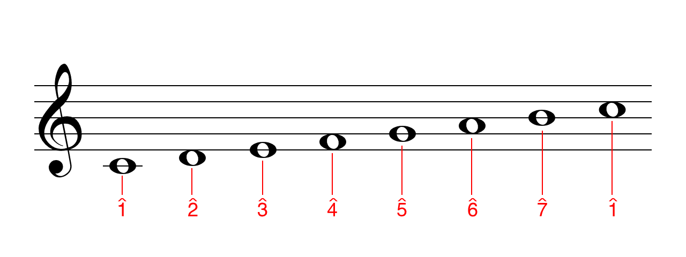

* A number with a caret (^) may also be used to indecate a scale degree.

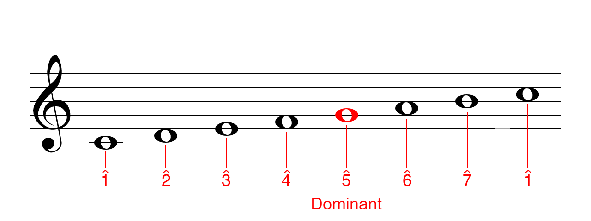

* For example, the dominant of a scale (G in the aboce example), may be labelled as a 5 with a caret (^).

---
### Resource
[Musictheory.net](https://www.musictheory.net/lessons) - 23. Scale Degrees